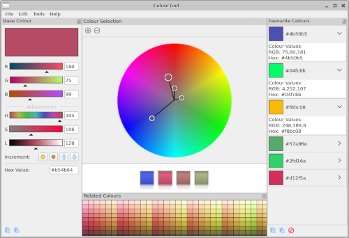
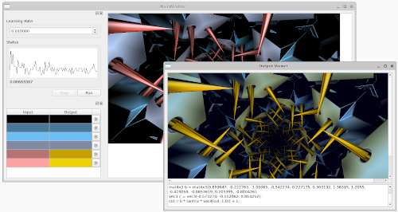
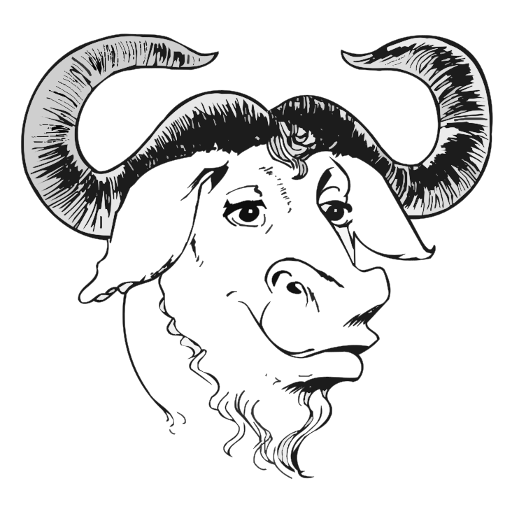
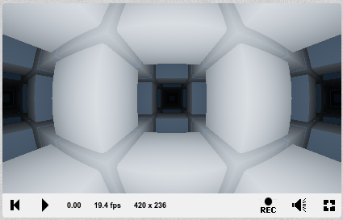

## Richard's Programming Portfolio

Here are some applications that I have developed in my free time.

## Colour Mixer in C++

I have developed an application in C++ using the Qt GUI libray for mixing colours. See the github repository for this project [here](https://github.com/maudsley/colourtool).

## Machine Learning in C++

I have developed a basic neural network to recolour images in C++ using Qt. The program also generates GLSL shader code which will apply the colour transformation to an image. See the github repository for this project [here](https://github.com/maudsley/qtmixer). See more information about this project [here](qtmixer.md).

## Custom Programming Language in C++

Using the bison & flex tools I partially developed a custom programming language in C++. The language resembles C but is interpretted rather than compiled. See the github repository for this project [here](https://github.com/maudsley/clike).

## Pixel Shaders in GLSL

I have created many pixel shaders which are small programs that select pixel colours based on a function of image location and time. Some of the pixel shaders can be seen on the ShaderToy website [here](https://www.shadertoy.com/user/dila).

