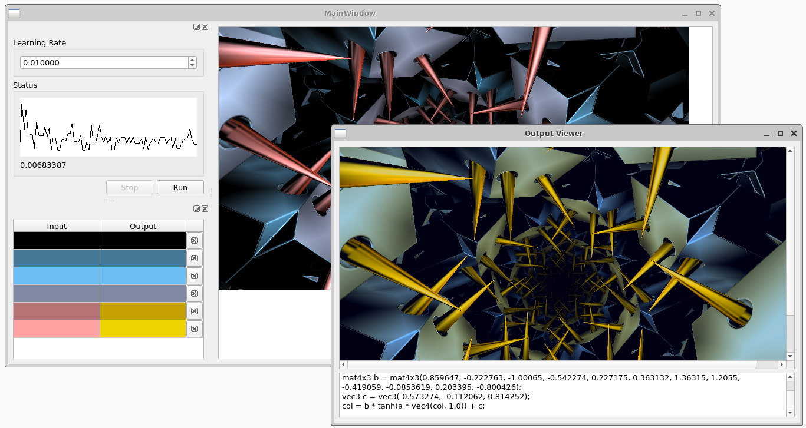

## GLSL Image Recolouring

I had planned to try to recreate a piece of software for Windows XP called ColorSchemer Studio. The now discontinued application allowed artists to create colour pallets and featured a graphical user interface for exploring colour spaces.

This GitHub repository contains a prototype of a feature designed to be used in my rewrite of ColorSchemer Studio. It is a machine learning feature to generate GLSL code to recolour an image.

## Screenshot



## Compiling

The application can be compiled with Qt 6 by loading the .pro file in QtCreator.

## Usage

1. When the application runs it will prompt for an input image. Select an image file from the file explorer and press Open in the application dialog. The main application window will then open and the image will be displayed in the window.
2. In the main application window click in the image to select an area to recolour. Clicking on an area in the image will open a colour selection dialog. You can choose a colour in this dialog that will replace the colour in the image. The main application window will show a list of colour pairs that the neural network will learn from.
3. Adjust the learning rate at the top of the application. A smaller learning rate than the default learning rate might be needed.
4. Press the Run button to let the network learn from the colour pairs.
5. The error level in the neural network is shown in the graph in the main window. When the error level is low enough press the Stop button to finish learning.
6. After the Stop button has been pressed the application will apply the recolouring transformation to the input image. This can take some time depending on the size of the selected image.
7. Once the image has been recoloured the output viewer window will open and the recoloured image will be shown along with the GLSL code that was applied to recolour the image.

## Output

A neural network is trained to fit a curve to the colour pairs that the user has selected. The application generates GLSL code from the weights that the neural network has learned. The GLSL code includes the neural network weights as floating point numbers. The input image is only a reference image to help the user select colour pairs. Example GLSL code is shown below.

```
mat4x4 a = mat4x4(0.485498, -0.078691, 0.655626, -0.484843, -0.406112, -1.50688, 1.20802, -0.18761, 0.371321, -1.23154, 1.05487, 0.690047, 0.466413, -0.147815, 1.46098, 0.627012);
mat4x3 b = mat4x3(0.758303, 0.170996, -0.0829161, 0.308136, -0.0881777, -0.039459, -0.239072, 0.152545, 0.356002, 0.783578, -0.0650423, -0.00626161);
vec3 c = vec3(-0.0953543, 0.337997, 0.405101);
col = b * tanh(a * vec4(col, 1.0)) + c;
```
